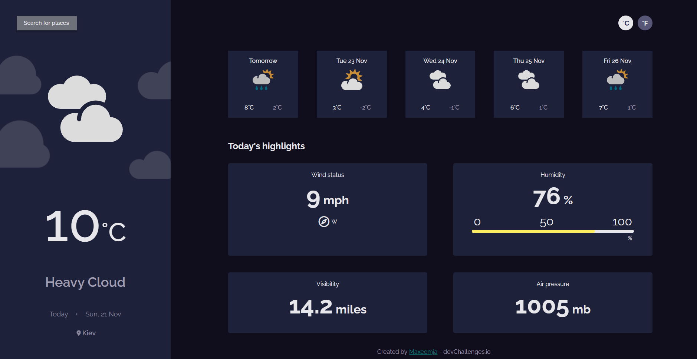

# Weather-app
> A user-friendly app for weather forecasts 

## General info
7th project from devChallenges. For the first time I used a cool React Query lib , which can easily manage with queries.
It was very challenging , but I deal with it!

Take a look at the [Demo page.](https://maxeemja.github.io/weather-app/)

## Used technologies
* HTML
* CSS
* JS
* React.JS , React-Query Lib

## Features
* See city weather as default, preferably your current location
* Search for city + autocomplete
* Outputs the weather for today + 5 next days
* See the date and location of the weather
* Image for each type of weather
* See some highlights for today
* Request current location weather (if permissions provided)
* Convert temperature in Celcius to Fahrenheit and vice versa
* Fully adaptive

